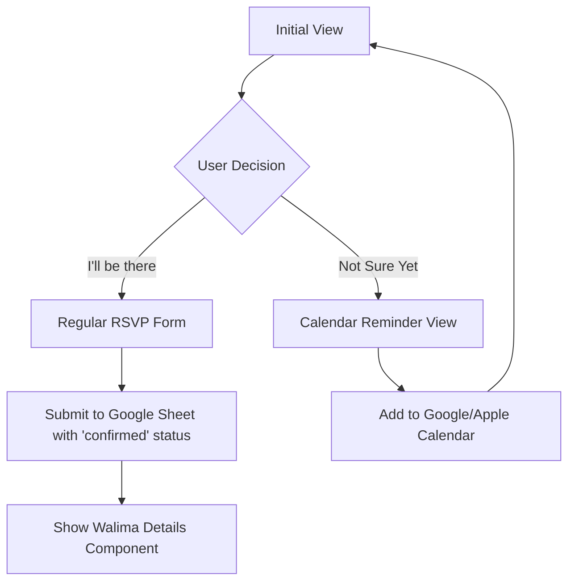
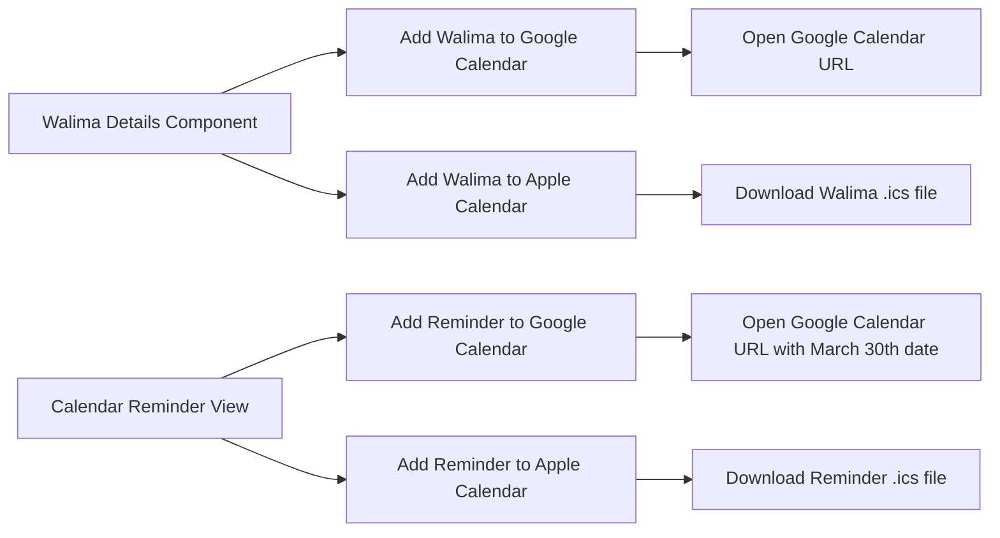
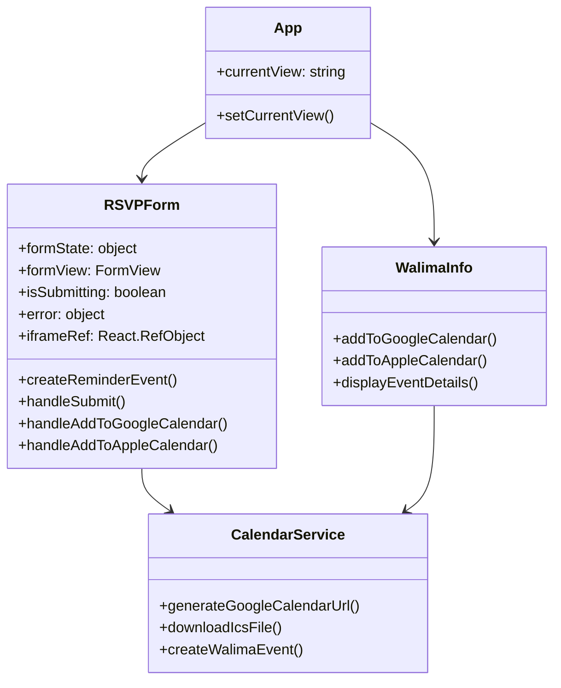

# Walima RSVP App - Technical Design Document

## Project Overview

This mobile-optimized Single Page Application (SPA) allows Walima guests to RSVP through a link sent via SMS. The app provides options for both confirmed and tentative RSVPs, displays Walima details, and offers calendar integration.

## Features

- **RSVP Form**: Collect guest information (name, phone, party size)
- **Calendar Reminder Option**: Allow guests who are unsure to add a reminder to their calendar
- **Google Sheets Integration**: Store confirmed RSVPs in a Google Sheet
- **Walima Details Display**: Show event information after submission
- **Calendar Integration**: Add Walima event or RSVP reminder to Google Calendar or Apple Calendar
- **Security Features**: Bot detection and rate limiting

## Technical Architecture

### Component Flow



````

### Form Submission

```mermaid
sequenceDiagram
    participant User
    participant RSVPForm
    participant HiddenIframe
    participant GoogleForms

    User->>RSVPForm: Submits RSVP
    RSVPForm->>HiddenIframe: Submit form data via hidden iframe
    HiddenIframe->>GoogleForms: POST request with form data
    HiddenIframe-->>RSVPForm: onLoad event triggered
    RSVPForm-->>User: Display success message
````

### Component State Management

```mermaid
stateDiagram-v2
    [*] --> InitialView
    InitialView --> ConfirmedForm: "I'll be there"
    InitialView --> CalendarView: "Not Sure Yet"
    ConfirmedForm --> SubmittingState
    CalendarView --> GoogleCalendar: "Add to Google Calendar"
    CalendarView --> AppleCalendar: "Add to Apple Calendar"
    CalendarView --> InitialView: "Back"
    SubmittingState --> ErrorState: API Error
    SubmittingState --> WalimaDetails: Success
    ErrorState --> RetrySubmission
    RetrySubmission --> SubmittingState
    GoogleCalendar --> InitialView
    AppleCalendar --> InitialView
```

### Calendar Integration



### Component Structure



## Implementation Details

### 1. Google Forms Integration

The app uses Google Forms to collect and store RSVP data:

- **Form Submission**: Direct submission to Google Forms via a hidden iframe
- **No Redirect**: Uses sandbox attributes and onLoad event handling to prevent redirect to the Google Forms response page
- **Data Structure**:
  - Name
  - Phone
  - Party Size
  - Status (confirmed/tentative)

#### Implementation Notes:

- Form data is submitted using a dynamically created form targeting a hidden iframe
- The iframe is sandboxed to prevent redirects while allowing form submission
- The onLoad event of the iframe is used to detect when the form submission is complete
- No API credentials required as we're using the public Google Forms endpoint

### 2. RSVP Form Implementation

The RSVP form has multiple states:

1. **Initial View**: Two buttons - "I'll be there" and "Not Sure Yet"
2. **Confirmed RSVP Form**: Standard form for confirmed guests
3. **Calendar Reminder View**: Options to add a reminder to calendar
4. **Success View**: Confirmation message and transition to Walima details
5. **Error View**: Error message with retry option

#### Form Fields:

- **Name**: Text input (required)
- **Phone**: Tel input (required)
- **Party Size**: Number input (required, min: 1)
- **Honeypot**: Hidden field to catch bots (security feature)

#### Form Submission:

- Uses a hidden iframe to submit data to Google Forms
- Prevents the default redirect to Google Forms' "Response Recorded" page
- Implements rate limiting to prevent multiple submissions
- Uses honeypot field to detect and block bot submissions
- Provides a seamless user experience by keeping users on the app

#### Calendar Reminder:

- For users selecting "Not Sure Yet"
- Creates a reminder event for March 30th, 2025 (ahead of the Walima date)
- Includes options for Google Calendar and Apple Calendar
- Reminder includes the Walima venue information
- Sets up alerts for 1 week and 1 day before the reminder date

### 3. Calendar Integration

The app provides two types of calendar events:

#### Walima Event (May 3rd, 2025):

- Available from the Walima Info component
- Contains full Walima details
- Includes venue information and time

#### RSVP Reminder Event (March 30th, 2025):

- Available when selecting "Not Sure Yet" on the RSVP form
- Reminds guests to make a final RSVP decision
- Set approximately one month before the Walima

For each event type, two calendar options are provided:

#### Google Calendar:

- Generate a URL with event parameters
- Format: `https://calendar.google.com/calendar/render?action=TEMPLATE&text={title}&dates={start}/{end}&details={description}&location={location}&add=POPUP=10080&POPUP=1440`
- Includes reminders at 1 week and 1 day before the event
- Opens in a new tab when clicked

#### Apple Calendar (.ics file):

- Generate an .ics file with event details
- Uses the proper VCALENDAR format with VALARM components for reminders
- Triggers download when clicked

### 4. Mobile Optimization

As this is a mobile-only application, special attention will be given to:

- **Touch-friendly UI**: Large buttons and input fields
- **Responsive Layout**: Proper spacing and sizing for mobile screens
- **Performance**: Minimize bundle size and optimize loading
- **Offline Support**: Basic functionality when connection is unstable

## Setup Instructions

### Environment Variables

Create a `.env` file in the project root with the following variables:

```
# No API keys required for the Google Forms approach
# You may add other environment variables as needed
```

### Development

1. Install dependencies:

   ```
   npm install
   ```

2. Start development server:
   ```
   npm run dev
   ```

### Production Build

1. Build the application:

   ```
   npm run build
   ```

2. Preview the production build:
   ```
   npm run preview
   ```

## File Structure

```
src/
├── App.tsx                    # Main application component
├── main.tsx                   # Entry point
├── index.css                  # Global styles
├── types.ts                   # Type definitions
├── components/
│   ├── RSVPForm.tsx           # RSVP form component with Google Forms integration
│   └── WalimaInfo.tsx        # Walima details component
├── services/
│   └── calendarService.ts     # Calendar integration utilities
├── utils/
│   └── formUtils.ts           # Form configuration and utilities
└── vite-env.d.ts             # TypeScript declarations
```

## Testing Considerations

- Test form submissions for confirmed RSVPs
- Test calendar reminder functionality for "Not sure yet" option
- Test both Google Calendar and Apple Calendar integration on different devices
- Test security features (honeypot field, rate limiting)
- Test error handling and edge cases
- Test with various network conditions
- Verify correct event dates for both Walima event and reminder event

## Future Enhancements

Potential future improvements:

- Email confirmation to guests
- Admin dashboard for managing RSVPs
- QR code generation for event check-in
- Photo gallery integration
