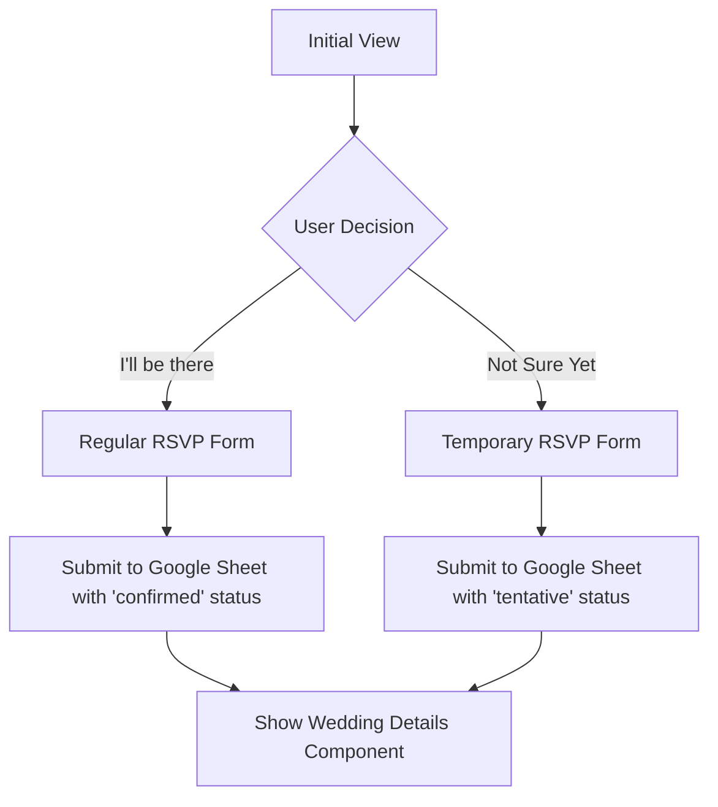
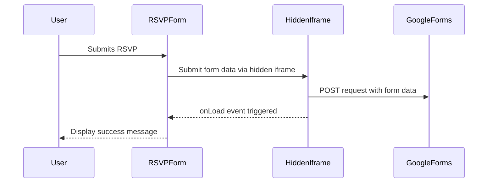
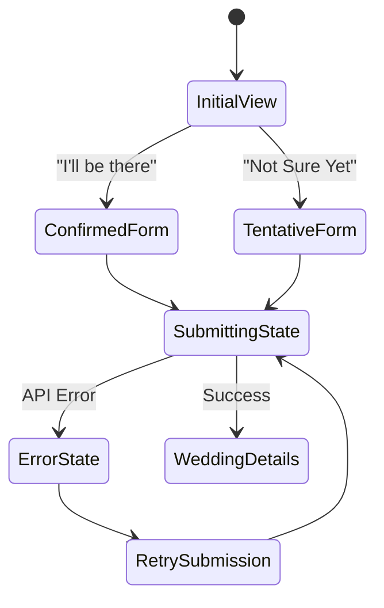
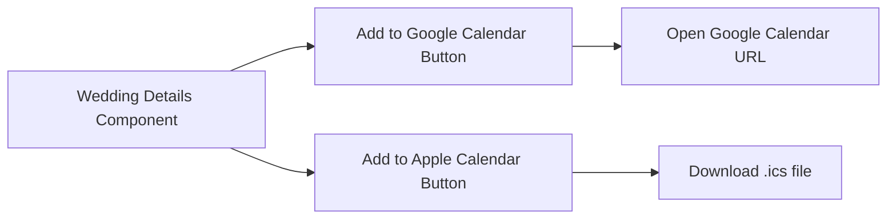
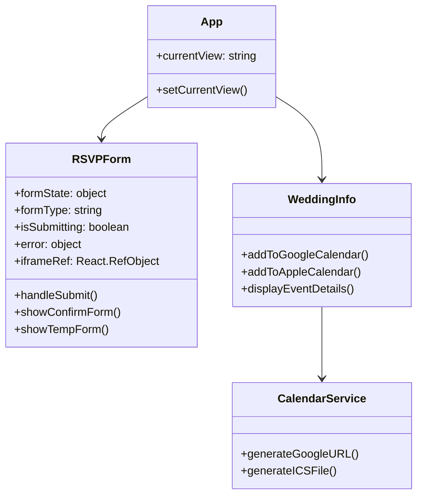

# Wedding RSVP App - Technical Design Document

## Project Overview

This mobile-optimized Single Page Application (SPA) allows wedding guests to RSVP through a link sent via SMS. The app provides options for both confirmed and tentative RSVPs, displays wedding details, and offers calendar integration.

## Features

- **RSVP Form**: Collect guest information (name, phone, party size)
- **Temporary RSVP Option**: Allow guests to indicate they're not sure yet
- **Google Sheets Integration**: Store all RSVPs in a Google Sheet
- **Wedding Details Display**: Show event information after submission
- **Calendar Integration**: Add to Google Calendar or Apple Calendar

## Technical Architecture

### Component Flow



### Form Submission



### Component State Management



### Calendar Integration



### Component Structure



## Implementation Details

### 1. Google Forms Integration

The app uses Google Forms to collect and store RSVP data:

- **Form Submission**: Direct submission to Google Forms via a hidden iframe
- **No Redirect**: Uses sandbox attributes and onLoad event handling to prevent redirect to the Google Forms response page
- **Data Structure**:
  - Name
  - Phone
  - Party Size
  - Status (confirmed/tentative)

#### Implementation Notes:

- Form data is submitted using a dynamically created form targeting a hidden iframe
- The iframe is sandboxed to prevent redirects while allowing form submission
- The onLoad event of the iframe is used to detect when the form submission is complete
- No API credentials required as we're using the public Google Forms endpoint

### 2. RSVP Form Implementation

The RSVP form has multiple states:

1. **Initial View**: Two buttons - "I'll be there" and "Not Sure Yet"
2. **Confirmed RSVP Form**: Standard form for confirmed guests
3. **Tentative RSVP Form**: Similar form for guests who aren't sure
4. **Success View**: Confirmation message and transition to wedding details
5. **Error View**: Error message with retry option

#### Form Fields:

- **Name**: Text input (required)
- **Phone**: Tel input (required)
- **Party Size**: Number input (required, min: 1, max: 10)

#### Form Submission:

- Uses a hidden iframe to submit data to Google Forms
- Prevents the default redirect to Google Forms' "Response Recorded" page
- Provides a seamless user experience by keeping users on the app

### 3. Calendar Integration

The app will provide two calendar options:

#### Google Calendar:

- Generate a URL with event parameters
- Format: `https://calendar.google.com/calendar/render?action=TEMPLATE&text={title}&dates={start}/{end}&details={description}&location={location}`
- Open in a new tab when clicked

#### Apple Calendar (.ics file):

- Generate an .ics file with event details
- Use the proper VCALENDAR format
- Trigger download when clicked

### 4. Mobile Optimization

As this is a mobile-only application, special attention will be given to:

- **Touch-friendly UI**: Large buttons and input fields
- **Responsive Layout**: Proper spacing and sizing for mobile screens
- **Performance**: Minimize bundle size and optimize loading
- **Offline Support**: Basic functionality when connection is unstable

## Setup Instructions

### Environment Variables

Create a `.env` file in the project root with the following variables:

```
# No API keys required for the Google Forms approach
# You may add other environment variables as needed
```

### Development

1. Install dependencies:

   ```
   npm install
   ```

2. Start development server:
   ```
   npm run dev
   ```

### Production Build

1. Build the application:

   ```
   npm run build
   ```

2. Preview the production build:
   ```
   npm run preview
   ```

## File Structure

```
src/
├── App.tsx                    # Main application component
├── main.tsx                   # Entry point
├── index.css                  # Global styles
├── types.ts                   # Type definitions
├── components/
│   ├── RSVPForm.tsx           # RSVP form component with Google Forms integration
│   └── WeddingInfo.tsx        # Wedding details component
├── services/
│   ├── googleSheetsService.ts # Google Sheets service (for reference)
│   └── calendarService.ts     # Calendar integration utilities
└── vite-env.d.ts             # TypeScript declarations
```

## Testing Considerations

- Test form submissions for both confirmed and tentative RSVPs
- Test calendar integration on different mobile devices and browsers
- Test error handling and edge cases
- Test with various network conditions

## Future Enhancements

Potential future improvements:

- Email confirmation to guests
- Admin dashboard for managing RSVPs
- QR code generation for event check-in
- Photo gallery integration
